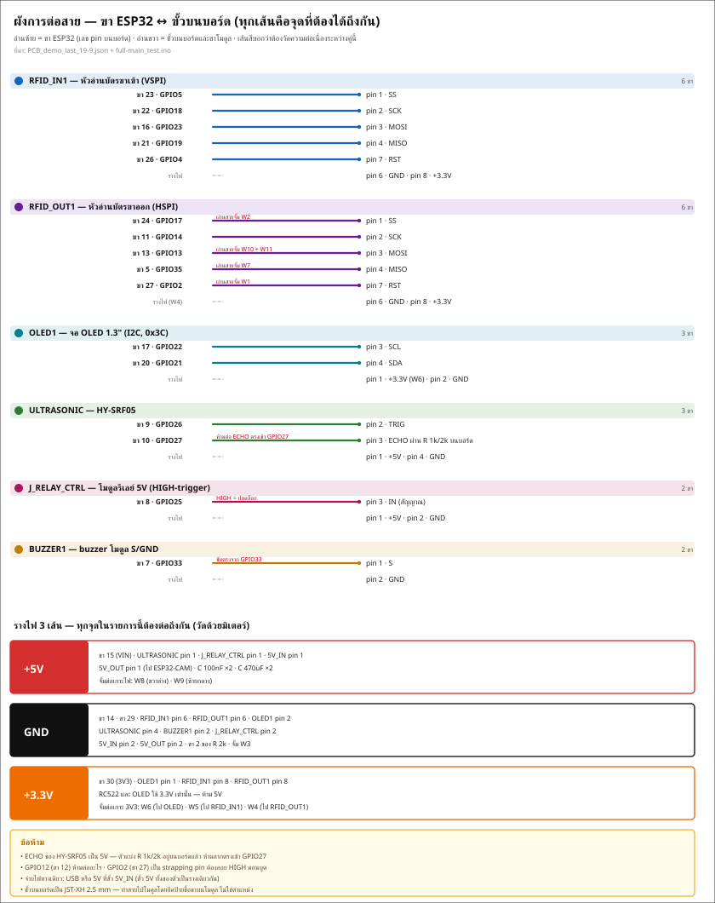
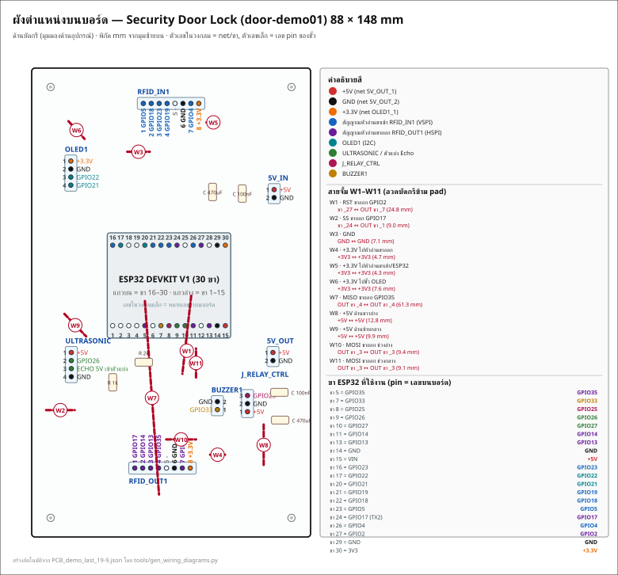

# คู่มือตำแหน่งต่อสายเพื่อบัดกรี — บอร์ด Security Door Lock (door-demo01 / testPCB)

**ไฟล์บอร์ด:** `PCB_demo_last_19-9.json` · ด้านเดียว (BottomLayer) · 88 × 148 mm · pad วงกลม 2.0 mm

ไฟล์นี้ตอบคำถามเดียว: **ตอนบัดกรี ต้องบัดกรีอะไรลงช่องไหน และลากสายไปเข้าขาไหนของโมดูล**
ข้อมูลทุกบรรทัดดึงจากไฟล์บอร์ดจริง (pad + net + พิกัด) แล้วเทียบกับ `firmware/esp32-main/src/esp_main/full-main_test.ino` — ไม่ใช่การกะจากรูป

> สร้างโดย `tools/gen_wiring_guide.py` — รันซ้ำได้เมื่อไฟล์บอร์ดเปลี่ยน (`python3 tools/gen_wiring_guide.py`)

## ผังภาพ (ดู 2 ภาพนี้ก่อน แล้วค่อยอ่านตาราง)

---

## 1. ระบบพิกัด (อ่านตารางให้ถูก)

- ต้นกำเนิด (0, 0) = **มุมซ้ายบนของบอร์ด** หน่วยเป็นมิลลิเมตร วัดตาม `BLUEPRINT_COMPONENT_SIDE.svg` (ด้านอุปกรณ์ / ด้านที่บัดกรี)
- บอร์ดกว้าง 88 mm สูง 148 mm
- ทุกขั้วต่อเป็น **JST-XH pitch 2.5 mm** ส่วนขา ESP32 เป็น 2.54 mm (ระยะห่างขาที่ติดกัน = 2.5 / 2.54 mm)
- รูยึดบอร์ด M2 (2.3 mm) 4 รู: (5.97, 5.97) · (81.97, 5.97) · (5.97, 141.97) · (81.97, 141.97)

## 2. ชื่อ net บนบอร์ด ≠ ชื่อไฟ ⚠️ อ่านก่อนบัดกรี

EasyEDA ตั้งชื่อ net ตามชื่อ pad ปลายทาง จึงดูสับสน ของจริงเป็นแบบนี้:

| ชื่อ net ในไฟล์ | = อะไรจริง ๆ |
|---|---|
| `5V_OUT_1` | **+5V** (ทั้งราง รวมขา VIN ของ ESP32) |
| `5V_OUT_2` | **GND** (กราวด์ร่วมทั้งบอร์ด) |
| `OLED1_1` | **+3.3V** (ทั้งราง รวมขา 3V3 ของ ESP32) |
| `RFID_IN1_n` / `RFID_OUT1_n` | ขาที่ n ของขั้วหัวอ่านขาเข้า / ขาออก |
| `ESP32_n` | ขาหมายเลข n ของ header ESP32 30 ขา (**n = เลข pin บน PCB ไม่ใช่เลข GPIO**) |

ตารางแปลงเลข pin → GPIO อยู่ข้อ 4 อย่าจำสลับกัน

---

## 3. ขั้วต่อทั้ง 8 ตัว — pin ไหน ต่ออะไร

พิกัด = ตำแหน่ง pad ของขานั้น วัดจากมุมซ้ายบนของบอร์ด (mm)

### RFID_IN1 — JST-XH 8 ขา (B8B-XH-AM, pitch 2.5 mm)

*หัวอ่านบัตรฝั่งเข้า (VSPI) — SS=5, SCK=18, MOSI=23, MISO=19, RST=4*

**pin 1 อยู่ซ้ายสุด (pin เพิ่มไปทางขวา)** — ยึดเลขที่พิมพ์บนขั้ว JST เป็นหลัก

| pin | พิกัด (mm) | net | ต่อกับอะไร |
|---|---|---|---|
| 1 | (35.23, 11.16) | `RFID_IN1_1` | GPIO5 — SS (ขาเข้า) |
| 2 | (37.73, 11.16) | `RFID_IN1_2` | GPIO18 — SCK (ขาเข้า) |
| 3 | (40.23, 11.16) | `RFID_IN1_3` | GPIO23 — MOSI (ขาเข้า) |
| 4 | (42.73, 11.16) | `RFID_IN1_4` | GPIO19 — MISO (ขาเข้า) |
| 5 | (45.23, 11.16) | `-` | — (ไม่ได้ต่อ) |
| 6 | (47.73, 11.16) | `5V_OUT_2` | GND (กราวด์ร่วม) |
| 7 | (50.23, 11.16) | `RFID_IN1_7` | GPIO4 — RST (ขาเข้า) |
| 8 | (52.73, 11.16) | `OLED1_1` | +3.3V (ราง 3V3) |

### RFID_OUT1 — JST-XH 8 ขา (B8B-XH-AM, pitch 2.5 mm)

*หัวอ่านบัตรฝั่งออก (HSPI) — SS=17, SCK=14, MOSI=13, MISO=35, RST=2*

**pin 1 อยู่ซ้ายสุด (pin เพิ่มไปทางขวา)** — ยึดเลขที่พิมพ์บนขั้ว JST เป็นหลัก

| pin | พิกัด (mm) | net | ต่อกับอะไร |
|---|---|---|---|
| 1 | (32.52, 126.24) | `RFID_OUT1_1` | GPIO17 — SS (ขาออก) *ผ่านสาย W2 |
| 2 | (35.03, 126.24) | `RFID_OUT1_2` | GPIO14 — SCK (ขาออก) |
| 3 | (37.52, 126.24) | `RFID_OUT1_3` | GPIO13 — MOSI (ขาออก) *ผ่านสาย W10+W11 |
| 4 | (40.03, 126.24) | `RFID_OUT1_4` | GPIO35 — MISO (ขาออก) *ผ่านสาย W7 |
| 5 | (42.53, 126.24) | `-` | — (ไม่ได้ต่อ) |
| 6 | (45.03, 126.24) | `5V_OUT_2` | GND (กราวด์ร่วม) |
| 7 | (47.53, 126.24) | `RFID_OUT1_7` | GPIO2 — RST (ขาออก) *ผ่านสาย W1 |
| 8 | (50.03, 126.24) | `OLED1_1` | +3.3V (ราง 3V3) |

### OLED1 — JST-XH 4 ขา (B4B-XH-AM)

*จอ OLED SH1106 1.3" I2C (ที่อยู่ 0x3C) — SDA=21, SCL=22*

**pin 1 อยู่บนสุด (pin เพิ่มลงล่าง)** — ยึดเลขที่พิมพ์บนขั้ว JST เป็นหลัก

| pin | พิกัด (mm) | net | ต่อกับอะไร |
|---|---|---|---|
| 1 | (12.36, 29.32) | `OLED1_1` | +3.3V (ราง 3V3) |
| 2 | (12.36, 31.86) | `5V_OUT_2` | GND (กราวด์ร่วม) |
| 3 | (12.36, 34.4) | `OLED1_3` | GPIO22 — SCL |
| 4 | (12.36, 36.94) | `OLED1_4` | GPIO21 — SDA |

### ULTRASONIC — JST-XH 4 ขา (B4B-XH-AM)

*HY-SRF05 — TRIG=26, ECHO=27 ผ่านตัวแบ่ง 1k/2k บนบอร์ด*

**pin 1 อยู่บนสุด (pin เพิ่มลงล่าง)** — ยึดเลขที่พิมพ์บนขั้ว JST เป็นหลัก

| pin | พิกัด (mm) | net | ต่อกับอะไร |
|---|---|---|---|
| 1 | (12.49, 89.78) | `5V_OUT_1` | +5V (ราง 5V) |
| 2 | (12.49, 92.32) | `ULTRASONIC_SENSOR1_2` | GPIO26 — TRIG |
| 3 | (12.49, 94.86) | `R4_1` | ECHO ดิบจากโมดูล (ก่อนตัวแบ่ง) |
| 4 | (12.49, 97.4) | `5V_OUT_2` | GND (กราวด์ร่วม) |

### J_RELAY_CTRL — JST-XH 3 ขา (B3B-XH-A)

*โมดูลรีเลย์ 5V (HIGH-trigger) — IN=25*

**pin 1 อยู่ล่างสุด (pin เพิ่มขึ้นบน)** — ยึดเลขที่พิมพ์บนขั้ว JST เป็นหลัก

| pin | พิกัด (mm) | net | ต่อกับอะไร |
|---|---|---|---|
| 1 | (68.11, 108.44) | `5V_OUT_1` | +5V (ราง 5V) |
| 2 | (68.11, 105.9) | `5V_OUT_2` | GND (กราวด์ร่วม) |
| 3 | (68.11, 103.36) | `ESP32_8` | GPIO25 — สัญญาณ Relay (IN) |

### BUZZER1 — JST-XH 2 ขา (B2B-XH-AM)

*Buzzer โมดูล S/GND (BZ-1295) — ขับตรงจาก GPIO33*

**pin 1 อยู่ล่างสุด (pin เพิ่มขึ้นบน)** — ยึดเลขที่พิมพ์บนขั้ว JST เป็นหลัก

| pin | พิกัด (mm) | net | ต่อกับอะไร |
|---|---|---|---|
| 1 | (58.59, 107.81) | `BUZZER1_1` | GPIO33 — สัญญาณ buzzer |
| 2 | (58.59, 105.27) | `5V_OUT_2` | GND (กราวด์ร่วม) |

### 5V_IN — JST-XH 2 ขา (B2B-XH-AM)

*ไฟเข้า 5V จาก USB/อะแดปเตอร์ 5V (pin1=+5V, pin2=GND)*

**pin 1 อยู่บนสุด (pin เพิ่มลงล่าง)** — ยึดเลขที่พิมพ์บนขั้ว JST เป็นหลัก

| pin | พิกัด (mm) | net | ต่อกับอะไร |
|---|---|---|---|
| 1 | (76.5, 38.34) | `5V_OUT_1` | +5V (ราง 5V) |
| 2 | (76.5, 40.88) | `5V_OUT_2` | GND (กราวด์ร่วม) |

### 5V_OUT — JST-XH 2 ขา (B2B-XH-AM)

*ไฟออก 5V ไปเลี้ยง ESP32-CAM (pin1=+5V, pin2=GND)*

**pin 1 อยู่บนสุด (pin เพิ่มลงล่าง)** — ยึดเลขที่พิมพ์บนขั้ว JST เป็นหลัก

| pin | พิกัด (mm) | net | ต่อกับอะไร |
|---|---|---|---|
| 1 | (76.12, 89.78) | `5V_OUT_1` | +5V (ราง 5V) |
| 2 | (76.12, 92.32) | `5V_OUT_2` | GND (กราวด์ร่วม) |

> พิกัดด้านบนคือ **pad ทองแดงของขานั้น** ใช้เทียบกับภาพ `BLUEPRINT_COPPER_SIDE.svg` (ด้านบัดกรี) และ `BLUEPRINT_COMPONENT_SIDE.svg` (ด้านอุปกรณ์) ได้โดยตรง

### 5V_IN กับ 5V_OUT แยกกันยังไง

ทั้งสองขั้วเป็นของเหมือนกันเป๊ะ (pin1 = `5V_OUT_1` = +5V, pin2 = `5V_OUT_2` = GND) ต่างกันแค่ตำแหน่ง: ตัวหนึ่งอยู่ **ขวาบน (y ≈ 39.6)** อีกตัวอยู่ **ขวากลาง (y ≈ 91.0)** ให้ดูป้าย `5V_IN` / `5V_OUT` บนซิลค์สกรีนบอร์ด ถ้าสลับกันก็ยังใช้งานได้เหมือนเดิม เพราะเป็นรางเดียวกัน

⚠️ **จ่ายไฟทางเดียว** — ใช้ USB หรือป้อน 5V ที่ขั้ว 5V_IN อย่างใดอย่างหนึ่ง อย่าจ่ายพร้อมกัน (เป็นรางเดียวกัน จะป้อนย้อนกลับเข้า USB)

---

## 4. ขา ESP32 (header 30 ขา) — pin ไหนคือ GPIO อะไร

- แถว A = ขา 1–15 อยู่ที่ y = 81.29 mm (EN อยู่ซ้ายสุด, pin เพิ่มไปทางขวา)
- แถว B = ขา 16–30 อยู่ที่ y = 55.89 mm (GPIO23 อยู่ซ้ายสุด)

| pin | พิกัด (mm) | GPIO | net | ใช้ทำอะไร |
|---|---|---|---|---|
| 1 | (25.54, 81.29) | EN | `-` | — (ไม่ได้ต่อ) |
| 2 | (28.08, 81.29) | GPIO36 (VP) | `-` | — (ไม่ได้ต่อ) |
| 3 | (30.62, 81.29) | GPIO39 (VN) | `-` | — (ไม่ได้ต่อ) |
| 4 | (33.16, 81.29) | GPIO34 | `-` | — (ไม่ได้ต่อ) |
| 5 | (35.7, 81.29) | GPIO35 | `RFID_OUT1_4` | GPIO35 — MISO (ขาออก) *ผ่านสาย W7 |
| 6 | (38.24, 81.29) | GPIO32 | `-` | — (ไม่ได้ต่อ) |
| 7 | (40.78, 81.29) | GPIO33 | `BUZZER1_1` | GPIO33 — สัญญาณ buzzer |
| 8 | (43.32, 81.29) | GPIO25 | `ESP32_8` | GPIO25 — สัญญาณ Relay (IN) |
| 9 | (45.86, 81.29) | GPIO26 | `ULTRASONIC_SENSOR1_2` | GPIO26 — TRIG |
| 10 | (48.4, 81.29) | GPIO27 | `R4_2` | GPIO27 — ECHO หลังตัวแบ่ง 1k/2k |
| 11 | (50.94, 81.29) | GPIO14 | `RFID_OUT1_2` | GPIO14 — SCK (ขาออก) |
| 12 | (53.48, 81.29) | GPIO12 | `-` | — (ไม่ได้ต่อ) |
| 13 | (56.02, 81.29) | GPIO13 | `RFID_OUT1_3` | GPIO13 — MOSI (ขาออก) *ผ่านสาย W10+W11 |
| 14 | (58.56, 81.29) | GND | `5V_OUT_2` | GND (กราวด์ร่วม) |
| 15 | (61.1, 81.29) | VIN | `5V_OUT_1` | +5V (ราง 5V) |
| 16 | (25.54, 55.89) | GPIO23 | `RFID_IN1_3` | GPIO23 — MOSI (ขาเข้า) |
| 17 | (28.08, 55.89) | GPIO22 | `OLED1_3` | GPIO22 — SCL |
| 18 | (30.62, 55.89) | GPIO1 (TX0) | `-` | — (ไม่ได้ต่อ) |
| 19 | (33.16, 55.89) | GPIO3 (RX0) | `-` | — (ไม่ได้ต่อ) |
| 20 | (35.7, 55.89) | GPIO21 | `OLED1_4` | GPIO21 — SDA |
| 21 | (38.24, 55.89) | GPIO19 | `RFID_IN1_4` | GPIO19 — MISO (ขาเข้า) |
| 22 | (40.78, 55.89) | GPIO18 | `RFID_IN1_2` | GPIO18 — SCK (ขาเข้า) |
| 23 | (43.32, 55.89) | GPIO5 | `RFID_IN1_1` | GPIO5 — SS (ขาเข้า) |
| 24 | (45.86, 55.89) | GPIO17 (TX2) | `ESP32_24` | GPIO17 — SS ขาออก (รอจั้ม W2) |
| 25 | (48.4, 55.89) | GPIO16 (RX2) | `-` | — (ไม่ได้ต่อ) |
| 26 | (50.94, 55.89) | GPIO4 | `RFID_IN1_7` | GPIO4 — RST (ขาเข้า) |
| 27 | (53.48, 55.89) | GPIO2 | `ESP32_27` | GPIO2 — RST ขาออก (รอจั้ม W1) |
| 28 | (56.02, 55.89) | GPIO15 | `-` | — (ไม่ได้ต่อ) |
| 29 | (58.56, 55.89) | GND | `5V_OUT_2` | GND (กราวด์ร่วม) |
| 30 | (61.1, 55.89) | 3V3 | `OLED1_1` | +3.3V (ราง 3V3) |

**ขาที่ปล่อยว่างไว้ (ห้ามบัดกรีสายต่อ):** pin 1 (EN), pin 2 (GPIO36 (VP)), pin 3 (GPIO39 (VN)), pin 4 (GPIO34), pin 6 (GPIO32), pin 12 (GPIO12), pin 18 (GPIO1 (TX0)), pin 19 (GPIO3 (RX0)), pin 25 (GPIO16 (RX2)), pin 28 (GPIO15)

⚠️ `GPIO12` เป็น strapping pin — คุมแรงดัน flash ตอนบูต **ห้ามดึงลง GND/ต่ออะไร** และ `GPIO2` (RST ของหัวอ่านขาออก) ต้องลอย HIGH ตอนเปิดเครื่อง อย่าใส่ pull-down

---

## 5. สายจั้ม 11 เส้น (W1–W11)

บอร์ดเป็น **ด้านเดียว ไม่มี via** สายที่ต้องข้ามลายทองแดงหรือคร่อมคนละมุมบอร์ด จึงต้องจั้มด้วยลวด — จุดจั้มมี pad 2.0 mm ฝังมาให้แล้วทุกจุด (ไม่ต้องหาขั้วเพิ่ม)

| สาย | หน้าที่ | จาก (mm) | ไป (mm) | ระยะ | net ที่ตรวจในไฟล์ |
|---|---|---|---|---|---|
| W1 | RST ขาออก GPIO2 | (50.33, 71.87) | (47.54, 96.51) | 24.8 mm | `ESP32_27` ↔ `RFID_OUT1_7` |
| W2 | SS ขาออก GPIO17 | (4.56, 107.94) | (13.56, 107.94) | 9.0 mm | `ESP32_24` ↔ `RFID_OUT1_1` |
| W3 | GND | (30.14, 26.4) | (37.25, 26.4) | 7.1 mm | `5V_OUT_2` ↔ `5V_OUT_2` |
| W4 | +3.3V ไปหัวอ่านขาออก | (56.3, 122.03) | (61.0, 122.03) | 4.7 mm | `OLED1_1` ↔ `OLED1_1` |
| W5 | +3.3V ไปหัวอ่านขาเข้า/ESP32 | (55.16, 17.13) | (59.48, 17.13) | 4.3 mm | `OLED1_1` ↔ `OLED1_1` |
| W6 | +3.3V ไปขั้ว OLED | (11.6, 16.75) | (16.68, 22.34) | 7.6 mm | `OLED1_1` ↔ `OLED1_1` |
| W7 | MISO ขาออก GPIO35 | (35.73, 73.52) | (40.17, 134.61) | 61.3 mm | `RFID_OUT1_4` ↔ `RFID_OUT1_4` |
| W8 | +5V ด้านขวาล่าง | (73.19, 112.51) | (73.19, 125.34) | 12.8 mm | `5V_OUT_1` ↔ `5V_OUT_1` |
| W9 | +5V ด้านซ้ายกลาง | (10.33, 77.58) | (17.19, 84.7) | 9.9 mm | `5V_OUT_1` ↔ `5V_OUT_1` |
| W10 | MOSI ขาออก ช่วงล่าง | (42.46, 117.21) | (51.86, 117.21) | 9.4 mm | `RFID_OUT1_3` ↔ `RFID_OUT1_3` |
| W11 | MOSI ขาออก ช่วงกลาง | (51.86, 97.65) | (51.86, 88.51) | 9.1 mm | `RFID_OUT1_3` ↔ `RFID_OUT1_3` |

ไฟล์บอร์ดมี pad ลอยทั้งหมด 20 จุด = 10 คู่ (W1, W3–W11) บวกขั้ว `W2` ที่เป็น footprint JUMPER WIRE 2 ขา — รวม 11 เส้นตรงกับคู่มือพิมพ์

วิธีจั้ม:

- สายสัญญาณ (W1, W2, W7, W10, W11) ใช้ลวดเส้นเล็ก 0.3–0.5 mm
- สายไฟ (W3–W6, W8, W9) ใช้เส้น 0.5 mm ขึ้นไป
- **W7 ยาวสุด 61 mm** ลากชิดขอบบอร์ดหรือใช้สายหุ้มฉนวน กันไปแตะลายอื่น
- บัดกรีทีละเส้นแล้ววัดไม่แตะลายข้าง ๆ ก่อนไปเส้นถัดไป

**ทำไมต้องมีสายจั้ม 2 กลุ่มนี้** (จะได้ไม่งงว่าทำไมลายไม่ถึง):

1. **รางไฟถูกแบ่งเป็นเกาะ** — +3.3V มี 3 เกาะ (W4, W5, W6), +5V มี 2 เกาะ (W8, W9), GND มี 1 เกาะ (W3)
2. **สัญญาณหัวอ่านขาออก (HSPI)** SS / RST / MISO / MOSI ถูกส่งไปคนละมุมบอร์ด จึงต้องจั้ม W1, W2, W7, W10+W11 — ซีกขา enter (VSPI) ลากลายตรงถึงกันหมดแล้ว

---

## 6. อุปกรณ์รอบข้าง (R, C)

| ตัว | ค่า | พิกัดขา (mm) | ต่อกับ |
|---|---|---|---|
| R 1k (1/4W) | 1 kΩ | (25.57, 102.98) และ (25.57, 95.36) | ขา 1 → ECHO ของ HY-SRF05 · ขา 2 → จุดกลางตัวแบ่ง |
| R 2k (1/2W) | 2 kΩ | (28.85, 92.82) และ (41.85, 92.82) | ขา 1 → จุดกลางตัวแบ่ง · ขา 2 → GND |
| C 100nF ×2 | 100 nF | (66.46, 37.07)/(66.46, 42.15) และ (75.61, 102.35)/(80.69, 102.35) | คร่อม +5V กับ GND (ไม่มีขั้ว) |
| C 470uF ×2 | 470 µF 10V | (57.07, 37.83)/(57.07, 40.37) และ (77.13, 111.11)/(79.67, 111.11) | คร่อม +5V กับ GND — **มีขั้ว** |

**ตัวแบ่งแรงดัน ECHO (R 1k + R 2k):** ขา 3 ของขั้ว ULTRASONIC → R 1k → จุดกลาง → R 2k → GND และจุดกลางเข้า pin 10 (GPIO27) — ECHO ของ HY-SRF05 เป็น 5V **ห้ามต่อตรงเข้า GPIO27 เด็ดขาด** ตัวแบ่งนี้อยู่บนบอร์ดแล้ว (5V × 2k/(1k+2k) ≈ 3.33V)

**C 470uF มีขั้ว:** ขาที่ต่อ `5V_OUT_1` (+5V) = ขั้วบวก ส่วนอีกขาเข้า GND — ก่อนบัดกรีดูแถบสี/เครื่องหมายลบบนตัวถังและเครื่องหมายที่ซิลค์สกรีนให้ตรงกัน ใส่กลับขั้วแล้วจะบวม/ระเบิดตอนจ่ายไฟ

---

## 7. ลำดับการบัดกรี + ตรวจก่อนจ่ายไฟ

1. **ตัวเตี้ยก่อน:** R 1k → R 2k → C 100nF ×2 → C 470uF ×2 (ระวังขั้วของ 470uF)
2. **ขั้วต่อ JST-XH ทั้ง 8 ตัว** — อย่าลืมว่าขั้ว 8 ขา ขา 1 อยู่ด้านซ้ายตามตารางข้อ 3
3. **หัว ESP32:** บัดกรีหัว female 2×15 (แนะนำ — ถอดเปลี่ยนบอร์ดได้) หรือบัดกรีตัว DevKit ลงไปตรง ๆ (รู ≈ 1.0 mm รับขา 0.64 mm ได้)
4. **จั้มสาย W1–W11** ทีละเส้นตามตารางข้อ 5 (ทำท้ายสุด เพราะจะบังจุดอื่น)
5. **วัด short ก่อนจ่ายไฟ** (โหมดต่อเนื่อง/โอห์ม): +5V ↔ GND · +3.3V ↔ GND · +5V ↔ +3.3V → ต้องไม่ต่อถึงกัน (ถ้าแตะกันให้หาสะพานบัดกรีก่อน ห้ามจ่ายไฟ)
6. **จ่ายไฟ 5V** ที่ขั้ว 5V_IN (อย่าเสียบ USB พร้อมกัน) แล้ววัด: ขา 1 ของ 5V_OUT ได้ 5V · ขา 1 ของ OLED1 (หรือ pin 30 ของ ESP32) ได้ 3.3V
7. **ตรวจความต่อเนื่องทีละ net** ตามตารางข้อ 8 (วัดจาก pad ขั้ว ไป pad ขาของ ESP32)
8. เสียบ USB → เปิด Serial Monitor 115200 → flash `full-main_test.ino` → ทาบบัตร

## 8. ตารางตรวจความต่อเนื่อง (วัดจริงด้วยมิเตอร์)

| จาก | ไป | ผ่าน |
|---|---|---|
| RFID_IN1 pin 1 | ESP32 pin 23 (GPIO5) | ลายทองแดง |
| RFID_IN1 pin 2 | ESP32 pin 22 (GPIO18) | ลายทองแดง |
| RFID_IN1 pin 3 | ESP32 pin 16 (GPIO23) | ลายทองแดง |
| RFID_IN1 pin 4 | ESP32 pin 21 (GPIO19) | ลายทองแดง |
| RFID_IN1 pin 6 | GND (ยืนยันกับ pin 14) | ลายทองแดง |
| RFID_IN1 pin 7 | ESP32 pin 26 (GPIO4) | ลายทองแดง |
| RFID_IN1 pin 8 | ESP32 pin 30 (3V3) | ผ่าน W5 |
| RFID_OUT1 pin 1 | ESP32 pin 24 (GPIO17) | ผ่าน W2 |
| RFID_OUT1 pin 2 | ESP32 pin 11 (GPIO14) | ลายทองแดง |
| RFID_OUT1 pin 3 | ESP32 pin 13 (GPIO13) | ผ่าน W10 + W11 |
| RFID_OUT1 pin 4 | ESP32 pin 5 (GPIO35) | ผ่าน W7 |
| RFID_OUT1 pin 7 | ESP32 pin 27 (GPIO2) | ผ่าน W1 |
| RFID_OUT1 pin 6 | GND (pin 14) | ลายทองแดง |
| RFID_OUT1 pin 8 | ESP32 pin 30 (3V3) | ผ่าน W4 |
| OLED1 pin 1 | ESP32 pin 30 (3V3) | ผ่าน W6 |
| OLED1 pin 2 | GND (pin 14) | ลายทองแดง |
| OLED1 pin 3 | ESP32 pin 17 (GPIO22) | ลายทองแดง |
| OLED1 pin 4 | ESP32 pin 20 (GPIO21) | ลายทองแดง |
| ULTRASONIC pin 1 | ESP32 pin 15 (VIN / +5V) | ลายทองแดง |
| ULTRASONIC pin 2 | ESP32 pin 9 (GPIO26) | ลายทองแดง |
| ULTRASONIC pin 3 | ขา 1 ของ R 1k | ลายทองแดง |
| ULTRASONIC pin 4 | GND (pin 14) | ลายทองแดง |
| ขา 2 ของ R 1k | ESP32 pin 10 (GPIO27) + ขา 1 ของ R 2k | จุดกลางตัวแบ่ง |
| ขา 2 ของ R 2k | GND (pin 14) | ลายทองแดง |
| BUZZER1 pin 1 | ESP32 pin 7 (GPIO33) | ลายทองแดง |
| BUZZER1 pin 2 | GND (pin 14) | ลายทองแดง |
| J_RELAY_CTRL pin 1 | +5V (pin 15) | ลายทองแดง |
| J_RELAY_CTRL pin 2 | GND (pin 14) | ลายทองแดง |
| J_RELAY_CTRL pin 3 | ESP32 pin 8 (GPIO25) | ลายทองแดง |
| 5V (ทั้งราง) | pin 15 (VIN) + ULTRASONIC pin 1 + RELAY pin 1 + 5V_OUT pin 1 | ผ่าน W8 + W9 |
| 3V3 (ทั้งราง) | pin 30 + OLED1 pin 1 + RFID_IN1 pin 8 + RFID_OUT1 pin 8 | ผ่าน W4 + W5 + W6 |

## 9. ต่อสายจากบอร์ดไปโมดูล — ทำสายให้ตรง

ขั้วบนบอร์ดเป็น JST-XH 2.5 mm แต่โมดูลทั่วไปเป็นขา 2.54 mm ต้องทำสาย 2 ด้าน (JST-XH ↔ ดูปองท์) โดยยึด **ป้ายบนโมดูล** เป็นหลัก:

- **RC522:** โมดูลเรียงขาไม่เหมือนกันในแต่ละร้าน (มักเป็น `SDA/SS · SCK · MOSI · MISO · IRQ · GND · RST · 3.3V` แต่มีรุ่นสลับหัวท้าย) → ดูชื่อขาบนตัวโมดูลแล้วทำสายให้ตรงกับ ตารางข้อ 3 ของขั้วนั้น · **ใช้ไฟ 3.3V เท่านั้น** ต่อ 5V แล้วชิปไหม้ทันที
- **OLED (SH1106 1.3"):** ขั้วบนบอร์ดเรียง `1=3.3V · 2=GND · 3=SCL · 4=SDA` ถ้าโมดูลเรียงเป็น `GND/VCC` ให้สลับตามป้าย ไม่ใช่ตามตำแหน่ง
- **HY-SRF05:** ขั้วบนบอร์ดเรียง `1=+5V · 2=TRIG · 3=ECHO · 4=GND` — โมดูลส่วนใหญ่เป็น `VCC/TRIG/ECHO/GND` ตรงกันอยู่แล้ว
- **โมดูลรีเลย์:** ขั้วบนบอร์ด `1=+5V · 2=GND · 3=IN(สัญญาณ)` — ตั้งโมดูลเป็น **HIGH-trigger** เพราะเฟิร์มแวร์สั่ง HIGH = ปลดล็อก ขั้วโซลินอยด์ 12V ต่อที่สกรู `COM/NO` บนตัวโมดูล (ไม่อยู่บนบอร์ดนี้)
- **Buzzer:** บอร์ดขับจาก GPIO33 ตรง ๆ (ไม่มีทรานซิสเตอร์บนบอร์ด) → ใช้ buzzer **โมดูล S/GND (BZ-1295)** ที่กินกระแสต่ำเท่านั้น
- **ESP32-CAM:** ต่อแค่ +5V/GND จากขั้ว 5V_OUT ไม่มีสายสัญญาณ (สั่งงานผ่าน ESP-NOW ระยะต้องตรงกับ `camMacAddress` ในโค้ด)

## 10. เช็กลิสต์สุดท้ายก่อนเปิดเครื่อง

- [ ] R 1k / R 2k บัดกรีถูกค่า (วัดด้วยโอห์มมิเตอร์: 1.0 kΩ และ 2.0 kΩ)
- [ ] C 470uF ทั้งสองตัวใส่ขั้วถูก (+ เข้า +5V)
- [ ] สายจั้ม W1–W11 ครบ 11 เส้น (ไล่ตามตารางข้อ 5 ทีละเส้น)
- [ ] ไม่มีสะพานบัดกรี: +5V ↔ GND · +3.3V ↔ GND · +5V ↔ +3.3V
- [ ] pin 12 (GPIO12) ไม่มีอะไรต่อ และ pin 27 (GPIO2) ไม่ถูกดึงลง GND
- [ ] จ่ายไฟ 5V แล้วได้ 5V ที่ขั้ว 5V_OUT และ 3.3V ที่ OLED1 pin 1
- [ ] ตรวจความต่อเนื่องตามตารางข้อ 8 ครบทุกบรรทัด

---

## โหมดทดลองก่อนบัดกรี (บนบอร์ดทดลอง/breadboard)

ถ้ายังไม่กล้าบัดกรี ใช้ตารางข้อ 3–4 เป็นผังต่อบนบอร์ดทดลองได้เลย: คอลัมน์ net/ต่อกับอะไร คือขา GPIO ที่ต้องจั้มหาขาโมดูล — สิ่งที่ห้ามลืมคือ **ECHO ต้องผ่านตัวแบ่ง 1k/2k** (บนบอร์ดทดลองต้องต่อเอง) และ **ห้ามใช้ไฟ 5V กับ RC522 / OLED**

